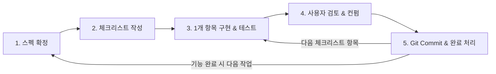

# TubeTalk 개발 프로세스 및 파일럿 가이드 (Development Workflow & Process)

본 문서는 TubeTalk 프로젝트의 개발 프로세스, 문서 운용 체계, 테스트 품질 기준 및 협업 수칙을 정의합니다.

---

## 1. 문서 체계 (Documentation Structure)

프로젝트 관련 문서는 `./docs/` 디렉토리 하위에서 아래와 같이 관리됩니다.

```text
docs/
├── prd.md                    # 제품 요구사항 정의서 (Product Requirements Document)
├── design.md                 # 시스템 설계서 (System Design Specification)
├── README.md                 # [본 문서] 개발 프로세스 및 협업 가이드
├── roadmap.md                # 전체 상위 레벨 로드맵 & Master Task Tracker
└── tasks/                    # 기능 단위 상세 스펙 & 체크리스트 폴더
    ├── 00-project-setup.md
    ├── 01-loader-pipeline.md
    └── ...
```

* **`docs/roadmap.md`**: 상위 기능별 진행 상태(`[ ]`, `[i]`, `[x]`) 관리.
* **`docs/tasks/XX-feature-name.md`**: 작업 진행 전 작성되는 기능별 상세 스펙, 테스트 케이스 세부 항목, 개별 체크리스트.

---

## 2. 5단계 반복 개발 프로세스 (5-Step Iterative Process)

모든 작업은 아래의 5단계를 거쳐 점진적(Incremental)으로 진행합니다.



### Step 1: 기능 선정 및 스펙 구체화 (Spec Refinement)
* `docs/roadmap.md`에서 다음 진행할 상위 작업 1개를 선정합니다.
* `docs/tasks/XX-feature.md` 문서를 생성하여 모듈 인터페이스, 입출력 구조, 예외 처리 및 유닛 테스트 시나리오를 구체화합니다.

### Step 2: 체크리스트 작성 (Checklist Breakdown)
* 기능 스펙을 기반으로 1회 요청 단위의 세분화된 체크리스트(`[ ] 항목`)를 구성하고 사용자 승인을 받습니다.

### Step 3: 1개 항목 구현 및 테스트 검증 (Agent Implementation & Testing)
* 체크리스트 항목 **1개만** 구현을 진행합니다.
* 대응되는 유닛 테스트 코드를 함께 작성/수정하고 `poetry run poe check`를 실행하여 테스트 통과 및 커버리지 90% 이상을 검증합니다.

### Step 4: 사용자 검토 및 컨펌 (User Review & Approval)
* 코드 변경 사항, 테스트 실행 결과, 커버리지 리포트를 정리하여 사용자에게 공유합니다.
* 피드백 반영 후 최종 컨펌을 획득합니다.

### Step 5: Git 커밋 & 상태 업데이트 (Commit & Progress Tracking)
* 승인된 단위 작업에 대해 Git 커밋(`git commit -m "feat(...): ..."`)을 수행합니다.
* `docs/tasks/XX-feature.md` 및 `docs/roadmap.md`의 체크리스트 항목을 `[x]`로 업데이트합니다.

---

## 3. 품질 보장 수칙 (Quality Rules)

### 3.1 필수 검증 커맨드 (`poetry run poe check`)
* 모든 체크리스트 구현 항목 완료 시 **`poetry run poe check`** 명령어를 구동하여 아래 3가지 검증을 100% 통과해야 합니다:
  1. `poetry run poe format` (Ruff 코드 포맷 검사)
  2. `poetry run poe lint` (Ruff 린트)
  3. `poetry run poe static` (Mypy strict 정적 분석)
  4. `poetry run poe test` (Pytest 구동 및 **유닛 테스트 커버리지 90% 이상** 유지)
* 루트 디렉토리의 [AGENTS.md](file:///Users/jesse/work/tubetalk/AGENTS.md) 지침에 따라 모든 코딩 에이전트가 본 품질 규칙을 참조합니다.

### 3.2 테스트 작성 수칙 (Unit Test Principles)
* 외부 API (YouTube Data/Transcript API, Gemini LLM API, ChromaDB 등) 호출은 Mocking(`pytest-mock` / `unittest.mock`)을 기본 적용하여 격리된 빠른 유닛 테스트 환경을 유지합니다.

### 3.3 커밋 컨벤션 (Git Commit Convention)
* `feat`: 새로운 기능 추가
* `test`: 테스트 코드 추가 및 수정
* `fix`: 버그 수정
* `refactor`: 코드 리팩토링 (기능 변화 없음)
* `docs`: 문서 수정
* `style`: 코드 포맷팅, 세미콜론 누락 등 (코드 변경 없음)

---

## 4. 새로운 세션 시작 시 조치 사항 (AI Agent Rules)
* AI Agent는 새로운 작업 요청을 받거나 세션이 재시작될 때 먼저 [AGENTS.md](file:///Users/jesse/work/tubetalk/AGENTS.md), [docs/README.md](file:///Users/jesse/work/tubetalk/docs/README.md) 및 [docs/roadmap.md](file:///Users/jesse/work/tubetalk/docs/roadmap.md)를 확인하여 현재 진행 위치 및 품질 게이트 규칙을 파악해야 합니다.
