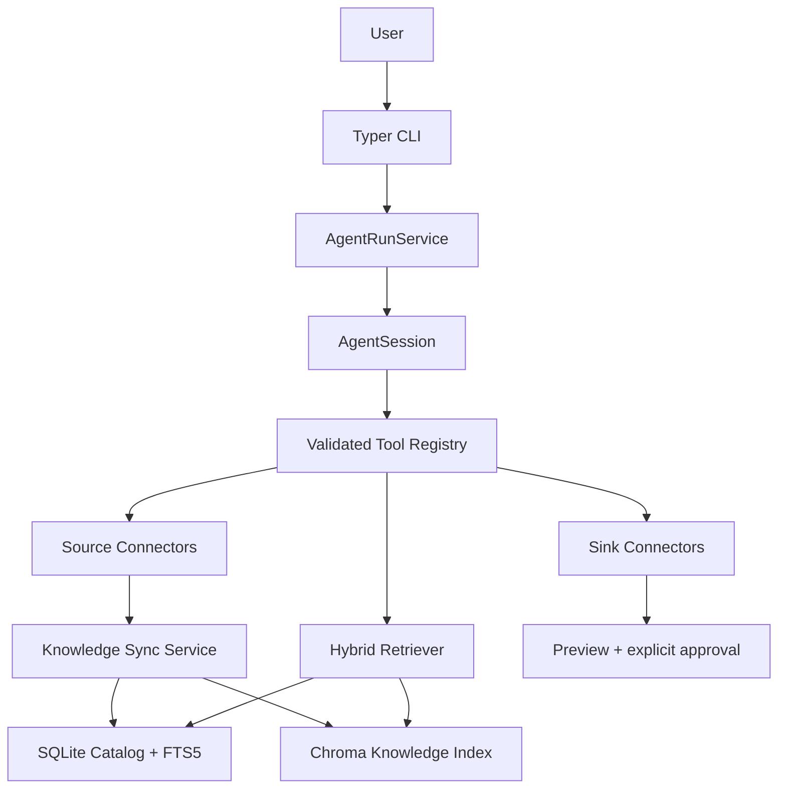
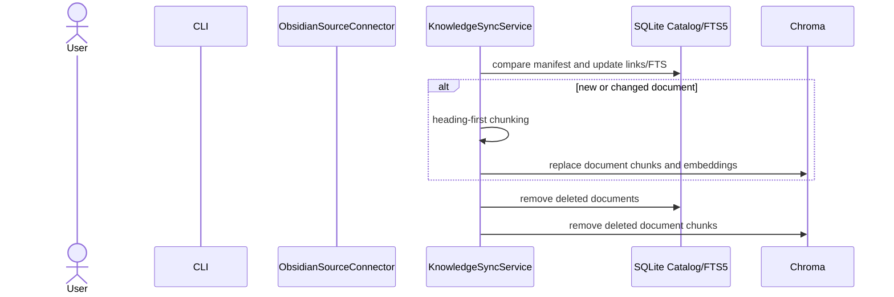

# System Design Specification: JesseAgent

## 1. 목표 아키텍처

JesseAgent는 Source·검색·Agent 도구·Sink를 분리한다. YouTube와 Obsidian은 공통 지식
경계로 투영되며 기존 영상 처리와 durable Agent run은 별도 책임을 유지한다.

## 2. 경계와 계약

### Knowledge model

`KnowledgeDocument`는 source-neutral 원문 레코드다. `source_id`, `document_id`, URI,
title, content, SHA-256, 변경 시각, JSON-safe metadata를 가진다. `KnowledgeChunk`는
문서 ID와 순번·본문·메타데이터를 가진 검색 단위다.

`SourceConnector`는 `source_id`와 안정적으로 정렬된 `list_documents()`를 제공한다.
sync 서비스가 connector, hash, 저장소, 재시도 정책을 조합하며 connector는 임베딩·DB·Agent
상태를 직접 다루지 않는다.

`SinkConnector`는 `plan()`과 `apply(approved_plan)` 계약을 갖는다. `plan()`은
사용자 미리보기에 충분한 변경 요약을 반환하고 `apply()`는 durable run의 승인 후에만 호출된다.
connector는 원문 읽기나 외부 반영만 담당하며 작업의 프롬프트·비즈니스 흐름·승인 판단을
소유하지 않는다.

`SinkPlan`은 plan ID, Sink ID, 작업명, preview와 JSON-safe payload를 가진 불변 계약이다.
승인 요청 이벤트는 이 계획과 preview를 함께 저장한다. 승인 후 `resume`은 이벤트에서 동일
계획을 복원해 재계획 없이 한 번만 `apply()`하며, 거절되거나 이미 완료된 계획은 적용하지
않는다. 현재는 이 계약과 상태 전이만 제공하고 production Sink connector는 등록하지 않는다.

### Source 구현 상태

- `YouTubeSourceConnector`: 현재 로컬 캐시의 완전한 자막을 timestamp-preserving
  `KnowledgeDocument`로 투영한다. 비전 장면은 기존 영상별 인덱스에 남아 있다.
- `ObsidianSourceConnector`: Markdown을 읽어 frontmatter·heading·tags·Wiki links와 수정
  시각을 metadata로 변환한다. 읽기 전용이며 watcher는 포함하지 않는다.

## 3. 색인과 검색 흐름

Obsidian sync의 구현 흐름은 아래와 같다.

`search_knowledge`는 SQLite FTS5 검색과 Gemini query embedding을 사용한 Chroma 검색을
독립적으로 수행하고 RRF로 상위 결과를 결합한다. 검색 결과는 chunk ID와 발췌를 제공하며,
카탈로그 근거에는 title·heading metadata·Obsidian URI가 포함된다. 기존 영상 Q&A는 별도의
자막·비전 검색과 검증된 YouTube timestamp 인용 흐름을 유지한다.

## 4. Agent 실행과 승인

CLI root는 명령 도움말만 제공한다. `jesseagent run`은 REPL이며, 같은 명령군의
`list/status/approve/reject/resume/delete`가 durable run lifecycle을 관리한다.
`jesseagent sources sync obsidian`은 Agent 대화와 분리된 명시적 Source 동기화 명령이다.

`AgentRunService`와 SQLite append-only event log는 계속 lifecycle source of truth다. 읽기
작업(검색, 원문 조회, 상태 조회)은 즉시 실행한다. 유료 생성, 새 Source 수집, Sink 적용은
`approval_requested` 이벤트를 기록하고 `pending_approval`에서 중지한다. 재개는 완료된
도구 호출을 다시 실행하지 않는다.

목표 `TaskDefinition`은 Agent가 호출할 하나의 등록형 작업이다. 이름·설명, Pydantic 입력/출력
schema, side-effect policy, 실행기, 필요한 Source/Sink, 프롬프트 kind/version을 가진다.
Gemini tool declaration은 Task Registry에서 파생하며, 모델은 등록된 작업과 schema-valid
인자만 선택할 수 있다.

목표 `TaskExecutor`는 TaskDefinition을 실행해 입력 검증, 제한된 context 조립, 프롬프트 렌더링,
결정론적 검증·재시도와 오류 요약을 담당한다. 사람이 조정하는 프롬프트는 저장소의 버전된
파일로 관리하고, 생성 산출물과 durable run에는 사용 버전을 기록한다. 따라서 새 작업은
Agent loop를 수정하지 않고 작업 등록·prompt 파일·bootstrap wiring으로 추가하며, Source와
Sink는 그 작업이 의존하는 I/O adapter로만 조합한다.

현재 구현은 `VideoToolExecutor` 내부 registry가 tool 이름을 Pydantic 입력 schema와 handler에
매핑하고 declaration을 파생한다. `search_knowledge`도 이 registry에 등록된다. 독립
`TaskDefinition`과 connector별 task package는 아직 일반화되지 않았다.

## 5. 저장소와 호환성

- 기존 `data/<video_id>/` JSON/영상별 Chroma 캐시는 유지한다.
- `knowledge.sqlite3`와 `knowledge_chromadb/`는 새 공통 검색 영역이며 기존 캐시와
  충돌하지 않는다.
- `agent_runs.sqlite3`의 event schema는 유지한다. Sink 계획에는 API 키, 전체 원문,
  렌더링 프롬프트를 넣지 않는다.
- Python 패키지와 CLI는 `jesseagent`로 통합됐으며, durable run 관리는
  `jesseagent run` 하위 명령으로 제공한다. `tubetalk` 호환 별칭은 제공하지 않는다.

## 6. 구현 상태와 후속 범위

- 완료: 공통 지식 모델, YouTube·Obsidian Source, heading chunking, 증분 sync,
  SQLite/FTS5·Chroma 인덱스, RRF 검색, `search_knowledge`, durable Sink plan 승인 계약.
- 후속: 독립 `TaskDefinition`/`TaskExecutor` 일반화, 실제 Sink adapter, Obsidian watcher/write,
  YouTube 비전 장면의 공통 지식 인덱스 통합.
