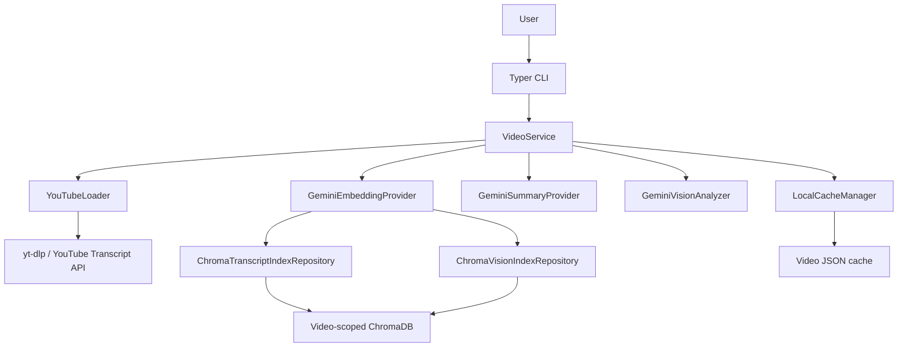
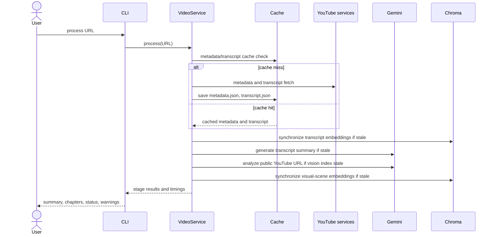

# System Design Specification: TubeTalk

## 1. 시스템 개요

TubeTalk는 YouTube 영상의 자막과 Gemini가 생성한 시각 장면 설명을 영상별 로컬
캐시와 ChromaDB에 저장하는 CLI 애플리케이션이다. 수집·인덱싱·자막 요약·상태 조회와
하이브리드 검색 기반 대화형 Q&A를 제공한다.



## 2. 처리 흐름

`tubetalk process <YOUTUBE_URL>`은 다음 흐름으로 동작한다.



수집 실패는 `process`를 실패시킨다. 반면 자막/비전 인덱싱과 요약 생성은 독립 단계로
실행되므로, 해당 단계의 Gemini·네트워크 오류는 경고로 반환하고 기존 캐시를 보존한다.

## 3. 구현 구조

```text
tubetalk/
├── bootstrap.py                    # Settings 기반 production wiring
├── cli/main.py                     # process, status, summary Typer commands
├── core/
│   ├── cache.py                    # JSON cache와 freshness 상태
│   └── config.py                   # Pydantic Settings
├── domain/                         # summary, vision, index, status models
├── ports/                          # provider/repository protocol 및 오류 경계
├── pipeline/loader.py              # YouTube URL, metadata, transcript collection
├── services/video_service.py       # application use cases와 단계 조율
└── infrastructure/
    ├── embeddings/gemini.py        # Gemini Embedding 2 adapter
    ├── summaries/gemini.py         # structured transcript-summary adapter
    ├── visions/gemini.py           # public YouTube URL scene analyzer
    └── repositories/
        ├── chroma_transcript.py    # transcript_collection
        └── chroma_vision.py        # vision_collection
```

`VideoService`는 인터페이스에만 의존하며, 실제 Gemini·Chroma 구현은
`bootstrap.create_video_service()`가 설정에 따라 연결한다. 이 경계로 테스트에서는
외부 API를 mock으로 대체한다.

## 4. 핵심 설계

### 자막 수집과 캐시

- `YouTubeLoader.extract_video_id()`는 일반 watch URL, short URL, shorts·embed URL에서 11자 video ID를 추출한다.
- 메타데이터는 `yt-dlp --dump-json --no-download`, 자막은 `youtube-transcript-api`로 수집한다.
- 기본 자막 언어 우선순위는 한국어(`ko`), 영어(`en`)다.
- `metadata.json`과 `transcript.json`이 모두 있으면 캐시 히트로 본다.

Whisper fallback, 오디오 처리, 로컬 영상 다운로드는 구현되어 있지 않다.

### 자막 요약

- `GeminiSummaryProvider`는 자막 전체를 시간 표기와 함께 전달하고 JSON 형식의 요약·목차를 요청한다.
- `summary.json` manifest는 자막 SHA-256, 모델, 프롬프트 버전, 언어, 생성 시각을 보관한다.
- 모델이 범위를 벗어난 목차 시간을 반환하면 한 번의 수정 요청 후 다시 검증한다.

### 비전 장면과 벡터 인덱스

- `GeminiVisionAnalyzer`는 공개 YouTube URL을 비디오 입력으로 Gemini에 전달한다. 장면은 전체 길이를 덮는 시간순 구간으로 요청한다.
- `vision_index.json`에는 장면과 source URL, 모델, 프롬프트 버전, 스키마 버전, 생성 시각이 저장된다.
- 자막은 `transcript_collection`, 장면 설명은 `vision_collection`에 명시적 벡터로 저장한다. 두 컬렉션 모두 영상별 `chromadb/` 경로에 있으며 cosine 거리를 사용한다.
- 각 컬렉션의 manifest는 원본 해시, 임베딩 모델·차원, 레코드 수, 인덱싱 시각을 기록해 current/stale/invalid/missing 상태를 판정한다.

## 5. CLI

| 명령 | 동작 |
| --- | --- |
| `tubetalk process <url>` | 수집 또는 캐시 재사용 후 자막·요약·비전 인덱스를 최신화하고 결과를 표시 |
| `tubetalk status [video_id]` | 전체 캐시 목록 또는 특정 영상의 캐시·인덱스 상세 상태 표시 |
| `tubetalk summary [video_id]` | 현재 요약을 표시. ID 생략 시 캐시 영상 선택 |
| `tubetalk summary <video_id> --generate` | 요약이 없거나 stale이면 생성 |
| `tubetalk chat [video_id]` | 자막·비전 근거를 융합해 멀티턴 Q&A. ID 생략 시 캐시 영상 선택 |

`chat`은 자막·비전 인덱스가 모두 최신일 때만 시작하며, 세션 기록은 디스크에 저장하지 않는다.

### 디버그 관찰성 및 프롬프트

Loguru는 CLI entry point에서 한 번만 설정되며, `tubetalk` 네임스페이스는 기본적으로
비활성화된다. `tubetalk --debug <command>`는 stderr에 cache·loader·Chroma·서비스·검색
단계와 렌더링된 Gemini 프롬프트를 기록한다. `--debug --verbose`는 TRACE 레벨의 원본 모델
응답도 추가한다. 로그에는 API 키·임베딩 벡터·전체 자막 원문을 기록하지 않지만 프롬프트,
질문, 검색 근거가 포함될 수 있으므로 진단 목적으로만 사용한다.

`tubetalk/prompts/`는 요약·비전·채팅과 각 수정 요청의 버전별 템플릿을 제공한다.
`SUMMARY_PROMPT_VERSION`, `VISION_PROMPT_VERSION`, `CHAT_PROMPT_VERSION`은 기능별 템플릿을
선택한다. 요약·비전의 선택 값은 기존 manifest `prompt_version` 최신성 판정에 사용한다.

## 6. 설정과 로컬 저장소

주요 환경 변수는 `GEMINI_API_KEY`, `DATA_DIR`, `SUMMARY_MODEL`, `VISION_MODEL`,
`EMBEDDING_MODEL`, `EMBEDDING_DIMENSION`, `SUMMARY_LANGUAGE`이다. 설정은 `.env`와
환경 변수에서 읽는다.

```text
data/{video_id}/
├── metadata.json
├── transcript.json
├── summary.json
├── vision_index.json
├── index_manifest.json
├── vision_vector_manifest.json
└── chromadb/
```

## 7. 후속 설계 범위

- 필요 시 vision provider 경계 뒤에 로컬 프레임 추출 또는 이미지 임베딩 구현
