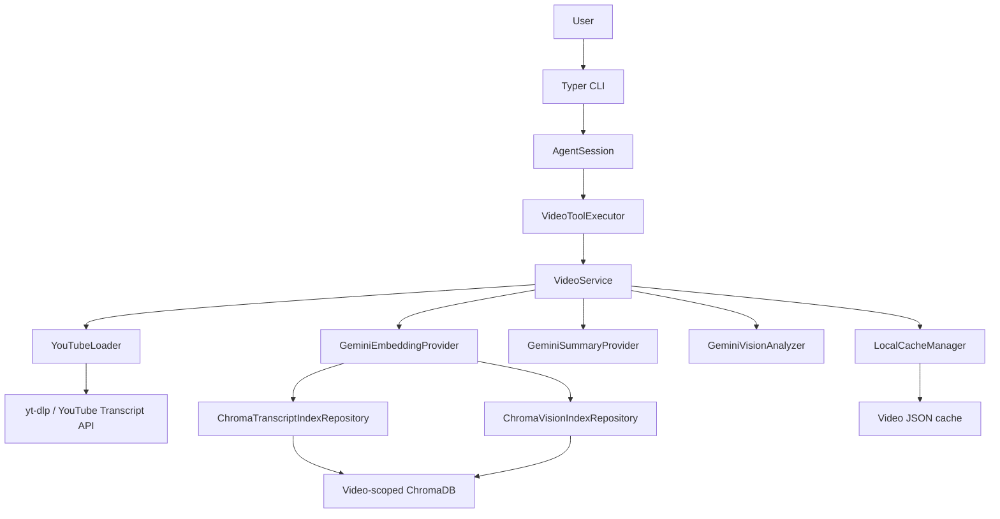
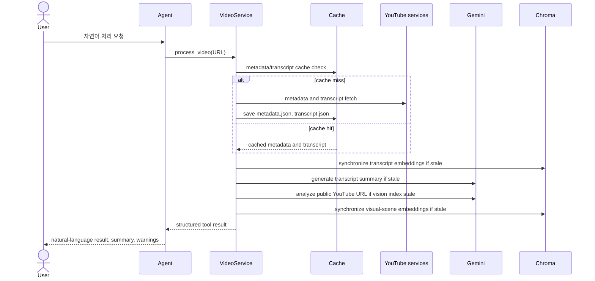
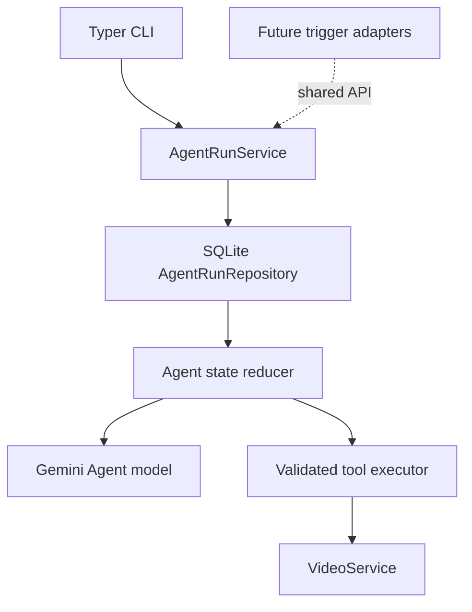

# System Design Specification: TubeTalk

## 1. 시스템 개요

TubeTalk는 YouTube 영상의 자막과 Gemini가 생성한 시각 장면 설명을 영상별 로컬
캐시와 ChromaDB에 저장하는 자연어 CLI Agent다. Agent는 Gemini native function calling으로
수집·인덱싱·요약·상태 조회·하이브리드 Q&A 도구를 선택하고, 결정론적 서비스 코드가 실행한다.



## 2. 처리 흐름

사용자가 “이 URL을 처리해줘”라고 요청하면 Agent가 `process_video(url)`을 선택하며, 이후
처리 흐름은 다음과 같다.



수집 실패는 `process`를 실패시킨다. 반면 자막/비전 인덱싱과 요약 생성은 독립 단계로
실행되므로, 해당 단계의 Gemini·네트워크 오류는 경고로 반환하고 기존 캐시를 보존한다.

## 3. 구현 구조

```text
tubetalk/
├── bootstrap.py                    # Settings 기반 production wiring
├── cli/main.py                     # REPL 및 단발성 자연어 Typer entry point
├── core/
│   ├── cache.py                    # JSON cache와 freshness 상태
│   └── config.py                   # Pydantic Settings
│   ├── logging.py                  # CLI debug logging
│   └── prompts.py                  # versioned prompt catalog
├── agent/                          # tool contracts, Agent loop, service tools, RRF
├── domain/                         # transcript, summary, vision, retrieval, status models
├── ports/                          # provider/repository protocol 및 오류 경계
├── pipeline/loader.py              # YouTube URL, metadata, transcript collection
├── prompts/                        # versioned summary, vision, chat templates
├── services/
│   ├── video_service.py            # application use cases와 ChatSession
│   ├── stages.py                   # independent processing stages
│   └── results.py                  # typed use-case results
└── infrastructure/
    ├── agents/gemini.py            # native function-calling Agent adapter
    ├── chats/gemini.py             # grounded chat adapter
    ├── embeddings/gemini.py        # Gemini Embedding 2 adapter
    ├── summaries/gemini.py         # structured transcript-summary adapter
    ├── visions/gemini.py           # public YouTube URL scene analyzer
    └── repositories/
        ├── chroma_transcript.py    # transcript_collection
        └── chroma_vision.py        # vision_collection
```

`VideoService`는 인터페이스에만 의존하며, 실제 Gemini·Chroma 구현은
`bootstrap.create_video_service()`가 설정에 따라 연결한다. 이 경계로 테스트에서는
외부 API를 mock으로 대체한다.

## 4. 핵심 설계

### 자막 수집과 캐시

- `YouTubeLoader.extract_video_id()`는 일반 watch URL, short URL, shorts·embed URL에서 11자 video ID를 추출한다.
- 메타데이터는 `yt-dlp --dump-json --no-download`, 자막은 `youtube-transcript-api`로 수집한다.
- 기본 자막 언어 우선순위는 한국어(`ko`), 영어(`en`)다.
- `metadata.json`과 `transcript.json`이 모두 있으면 캐시 히트로 본다.

Whisper fallback, 오디오 처리, 로컬 영상 다운로드는 구현되어 있지 않다.

### 자막 요약

- `GeminiSummaryProvider`는 자막 전체를 시간 표기와 함께 전달하고 JSON 형식의 3~5문장 요약·목차를 요청한다. 응답은 비어 있지 않은 요약과 시간순 목차로 검증하며, 요약 문장 수는 강제하지 않는다.
- `summary.json` manifest는 자막 SHA-256, 모델, 프롬프트 버전, 언어, 생성 시각을 보관한다.
- 모델이 범위를 벗어난 목차 시간을 반환하면 한 번의 수정 요청 후 다시 검증한다.

### 비전 장면과 벡터 인덱스

- `GeminiVisionAnalyzer`는 공개 YouTube URL을 비디오 입력으로 Gemini에 전달한다. 장면은 전체 길이를 덮는 시간순 구간으로 요청하며, 응답 시간은 영상 길이 안으로 보정하고 시작 시간순으로 정렬한다. 장면 간 공백 없는 전체 커버리지는 검증하지 않는다.
- `vision_index.json`에는 장면과 source URL, 모델, 프롬프트 버전, 스키마 버전, 생성 시각이 저장된다.
- 자막은 `transcript_collection`, 장면 설명은 `vision_collection`에 명시적 벡터로 저장한다. 두 컬렉션 모두 영상별 `chromadb/` 경로에 있으며 cosine 거리를 사용한다.
- 각 컬렉션의 manifest는 원본 해시, 임베딩 모델·차원, 레코드 수, 인덱싱 시각을 기록해 current/stale/invalid/missing 상태를 판정한다.

## 5. CLI

| 실행 | 동작 |
| --- | --- |
| `tubetalk` | 멀티턴 자연어 REPL을 시작한다. |
| `tubetalk "요청"` | 한 자연어 요청을 처리하고 종료한다. |

Agent는 `process_video`, `list_videos`, `get_video_status`, `get_summary`,
`answer_video_question`만 호출할 수 있다. 도구 입력은 Pydantic schema로 검증하고, 서비스
오류는 모델 문맥에 구조화해 전달한다. Agent 세션은 현재 영상 ID와 영상별 Q&A 이력을
메모리에만 보관한다.

### 디버그 관찰성 및 프롬프트

Loguru는 CLI entry point에서 한 번만 설정되며, `tubetalk` 네임스페이스는 기본적으로
비활성화된다. `tubetalk --debug "요청"`은 stderr에 cache·loader·Chroma·서비스·검색
단계와 렌더링된 Gemini 프롬프트를 기록한다. `--debug --verbose`는 TRACE 레벨의 원본 모델
응답도 추가한다. 로그에는 API 키·임베딩 벡터를 기록하지 않지만, 렌더링된 요약 프롬프트에는
전체 자막 원문이 포함되고 채팅 프롬프트에는 질문·검색 근거가 포함될 수 있으므로 진단 목적으로만 사용한다.

`tubetalk/prompts/`는 요약·비전·채팅과 각 수정 요청의 버전별 템플릿을 제공한다.
`SUMMARY_PROMPT_VERSION`, `VISION_PROMPT_VERSION`, `CHAT_PROMPT_VERSION`,
`AGENT_PROMPT_VERSION`은 기능별 템플릿을
선택한다. 요약·비전의 선택 값은 기존 manifest `prompt_version` 최신성 판정에 사용한다.

## 6. 설정과 로컬 저장소

주요 환경 변수는 `GEMINI_API_KEY`, `DATA_DIR`, `LLM_MODEL`, `SUMMARY_MODEL`,
`VISION_MODEL`, `EMBEDDING_MODEL`, `EMBEDDING_DIMENSION`, `SUMMARY_LANGUAGE`,
`SUMMARY_PROMPT_VERSION`, `VISION_PROMPT_VERSION`, `CHAT_PROMPT_VERSION`,
`AGENT_PROMPT_VERSION`, `AGENT_MAX_STEPS`이다. 설정은
`.env`와 환경 변수에서 읽는다.

```text
data/{video_id}/
├── metadata.json
├── transcript.json
├── summary.json
├── vision_index.json
├── index_manifest.json
├── vision_vector_manifest.json
└── chromadb/
```

## 7. Task 12 목표 아키텍처: Durable Agent Runs

Task 12는 현재 process-local `AgentSession`을 `AgentRunService`로 감싼다. CLI는 이
서비스의 유일한 어댑터로 남고, 미래 HTTP·webhook·batch 어댑터도 같은 API를 호출한다.
각 실행은 `DATA_DIR/agent_runs.sqlite3`의 append-only 이벤트를 source of truth로 사용한다.



- 실행 상태는 `running`, `pending_approval`, `paused`, `completed`, `failed`,
  `cancelled` 중 하나이며, reducer는 `user_request`, `model_decision`, `tool_call`,
  `tool_result`, `approval_requested`, `approval_resolved`, `paused`,
  `final_response`, `failure` 이벤트로부터 상태를 계산한다.
- `launch`, `get_status`, `approve`, `reject`, `resume`, `list_runs`, `delete_run`
  은 `AgentRunService`가 제공하는 애플리케이션 API다. 재개는 완료된 tool call을
  다시 실행하지 않는다.
- 새 외부 분석/생성 호출과 캐시 재생성은 `pending_approval`에서 멈춘다. 조회·검색·상태
  도구는 즉시 실행한다.
- 이벤트는 사용자가 삭제할 때까지 보관한다. API 키, 전체 렌더링 프롬프트, 자막 원문은
  이벤트에 저장하지 않는다.
- 모델 컨텍스트는 설정된 턴·크기 예산을 넘기면 결정론적으로 축약한다. 사용자 출력의
  인용과 근거는 축약하지 않는다.
- `AgentRunTrigger` port가 이 lifecycle API를 선언한다. 현재 `tubetalk-runs`가 이를
  호출하며, 미래 HTTP endpoint는 `launch(request)`, webhook은 검증된 payload를 request로
  변환해 `launch`, batch는 저장된 `run_id`로 `resume`만 호출한다. 어느 adapter도 모델 loop,
  이벤트 기록, 승인 상태 전이를 직접 구현하지 않는다.

## 8. 후속 설계 범위

- 필요 시 vision provider 경계 뒤에 로컬 프레임 추출 또는 이미지 임베딩 구현
