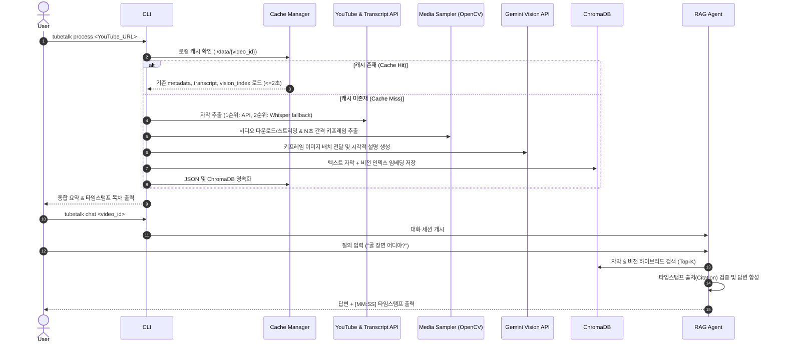

# System Design Specification: TubeTalk (YouTube Video Intelligence Agent)

## 1. 시스템 개요 (System Overview)

TubeTalk는 유튜브 영상의 텍스트 자막(Transcript)과 비전(Vision) 키프레임 인덱싱 데이터를 결합하여, 하이브리드 RAG 파이프라인을 구동하는 터미널 기반 CLI AI Agent입니다. 

### 1.1 하이레벨 아키텍처 (High-Level Architecture)

```mermaid
graph TD
    User([User CLI / Terminal]) --> CLI[CLI Module - Typer & Rich]
    CLI --> Core[Orchestrator / Core Pipeline]
    
    subgraph Ingestion & Processing Pipeline
        Core --> Loader[YouTube Loader - yt-dlp & Transcript API]
        Core --> Sampler[Keyframe Sampler - OpenCV]
        Core --> VisionIndexer[Vision Indexer - Gemini Vision API]
    end

    subgraph Storage Layer
        Core --> CacheMgr[Local Cache Manager - ./data/{video_id}/]
        CacheMgr --> FileStore[JSON Files - transcript, vision_index, metadata]
        CacheMgr --> VectorStore[ChromaDB - Text & Vision Embeddings]
    end

    subgraph Agent & RAG Engine
        CLI --> Agent[Interactive Q&A Agent]
        Agent --> HybridRetriever[Hybrid Retriever - Transcript + Vision]
        HybridRetriever --> VectorStore
        Agent --> LLM[Multimodal LLM Engine - Gemini 2.5 Pro]
    end
```

---

## 2. 데이터 흐름 및 파이프라인 (Data Pipeline Flow)



---

## 3. 모듈별 상세 설계 (Module Specifications)

### 3.1 디렉토리 구조 (Directory Structure)

```text
tubetalk/
├── cli/
│   ├── __init__.py
│   ├── main.py             # Typer CLI 엔트리포인트 (commands: process, chat, summary, clean)
│   └── ui.py               # Rich UI 포맷터 (Spinner, Markdown, Tables, Timestamps)
├── core/
│   ├── __init__.py
│   ├── config.py           # 환경변수, 설정 및 경로 관리 (Pydantic Settings)
│   └── cache.py            # ./data/{video_id}/ 로컬 영속화 캐시 관리자
├── pipeline/
│   ├── __init__.py
│   ├── loader.py           # yt-dlp 메타데이터 파싱 & youtube-transcript-api (Whisper fallback)
│   ├── media_processor.py  # OpenCV 기반 키프레임 추출 및 Scene Change Detection
│   └── vision_indexer.py   # Gemini 2.5 Flash 비전 씬 디스크립터 생성
├── storage/
│   ├── __init__.py
│   └── vector_store.py     # ChromaDB 클라이언트 및 듀얼 컬렉션 (Transcript/Vision) 관리
├── agent/
│   ├── __init__.py
│   ├── retriever.py        # 하이브리드 Retriever (RRF / Dense Dual Search)
│   ├── prompt.py           # 요약, 목차, 시각 Q&A 프롬프트 템플릿
│   └── chat_session.py     # Multi-turn 대화 세션 및 메모리 관리자
└── tests/                  # 단위 및 통합 테스트
```

### 3.2 핵심 모듈 사양

1. **`pipeline/loader.py` (자막 수집)**:
   - `youtube-transcript-api`를 1순위로 실행하여 수초 단위 타임코드와 자막 텍스트 수집.
   - 자막이 비활성화되었거나 자동 생성이 실패한 경우 `yt-dlp`로 오디오만 추출하여 Whisper / Gemini Audio API로 fallback 처리.

2. **`pipeline/media_processor.py` (비전 프레임 샘플링)**:
   - `yt-dlp`로 저화질 비디오(예: 360p/480p, 용량/속도 최적화)를 임시 다운로드.
   - `OpenCV`를 사용해 일정 시간 간격(예: 5초 기본) 샘플링 또는 프레임 차이 기반 Scene Change Detection 적용.

3. **`pipeline/vision_indexer.py` (비전 씬 인덱서)**:
   - 추출된 키프레임 이미지를 시간 순서대로 묶어 Gemini 2.5 Flash Multimodal API에 전송.
   - 결과물로 `[{"timestamp": "01:23", "start_sec": 83, "description": "빨간 옷을 입은 선수가 슛을 날려 골을 넣는 장면"}, ...]` 형태의 시각적 설명 JSON 생성.

4. **`storage/vector_store.py` & `agent/retriever.py` (하이브리드 RAG)**:
   - ChromaDB에 2개의 컬렉션 구성:
     - `transcript_collection`: 자막 텍스트 세그먼트 (타임스탬프 메타데이터 포함)
     - `vision_collection`: 시각적 설명 세그먼트 (타임스탬프 메타데이터 포함)
   - 사용자 질문 수신 시 듀얼 임베딩 검색 후 점수 결합(Reciprocal Rank Fusion 또는 Weighted Score)을 통해 상위 구간 추출.

---

## 4. 로컬 데이터 저장 스키마 (Local Storage Schema)

```text
./data/{video_id}/
├── metadata.json           # 영상 기본정보
├── transcript.json         # 자막 데이터
├── vision_index.json       # 시각적 씬 설명 데이터
├── frames/                 # (선택) 키프레임 이미지들 (jpg/png)
└── chromadb/               # ChromaDB SQLite 및 인덱스 파일들
```

### 4.1 `metadata.json`
```json
{
  "video_id": "dQw4w9WgXcQ",
  "title": "Sample Video Title",
  "duration_sec": 212,
  "author": "Channel Name",
  "processed_at": "2026-07-22T14:24:35+09:00",
  "has_official_transcript": true
}
```

### 4.2 `transcript.json`
```json
[
  {
    "start_sec": 0.0,
    "duration_sec": 3.5,
    "text": "Hello world welcome to the video."
  }
]
```

### 4.3 `vision_index.json`
```json
[
  {
    "start_sec": 0,
    "end_sec": 5,
    "timestamp_str": "00:00",
    "visual_summary": "밝은 조명의 스튜디오 배경, 진행자가 빨간 셔츠를 입고 등장함.",
    "detected_objects": ["speaker", "red shirt", "studio"],
    "keyframe_file": "frames/frame_000.jpg"
  }
]
```

---

## 5. 확정된 설계 결정 사항 (Confirmed Design Decisions)

1. **LLM & Vision Provider**:
   - Google Gemini API 전용 파이프라인 구축 (`google-genai` / `langchain-google-genai`).
   - **비전 씬 인덱싱**: `gemini-2.5-flash` (빠른 프레임 분석 및 비용/속도 최적화).
   - **종합 요약 및 대화형 Q&A Agent**: `gemini-2.5-pro` (복잡한 문맥 추론 및 고성능 하이브리드 RAG 답변 생성).

2. **키프레임 추출 방식 및 프레임 샘플링**:
   - **기본 모드**: 고정 5초 간격 샘플링.
   - **옵션 모드**: OpenCV 기반 Scene Change Detection (`--detect-scenes` 플래그) 선택적 사용 지원.

3. **CLI 명령어 구조 (Typer 기반 서브커맨드)**:
   - `tubetalk process <YouTube_URL>`: 영상 분석, 자막 추출, 비전 인덱싱 및 캐시 저장 후 요약 출력.
   - `tubetalk chat <video_id>`: 저장된 데이터 기반 터미널 대화형 Q&A 세션 실행.
   - `tubetalk summary <video_id>`: 보관된 영상 요약 및 타임스탬프 목차 즉시 재조회 (캐시 2초 이내 출력).

4. **하이브리드 검색 및 타임스탬프 검증 알고리즘**:
   - **Dual Vector Retrieval**: ChromaDB 내 `transcript` 컬렉션과 `vision_index` 컬렉션을 독립적으로 벡터 검색.
   - **Reciprocal Rank Fusion (RRF)**: 자막 결과와 시각적 씬 설명 검색 결과 순위를 융합.
   - **Timestamp Citation Validator**: 답변 생성시 명시되는 타임스탬프가 실존하는 씬/자막 구간인지 검증하는 후처리 레이어 포함.

